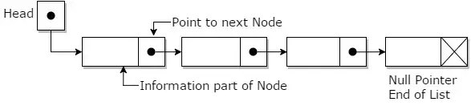
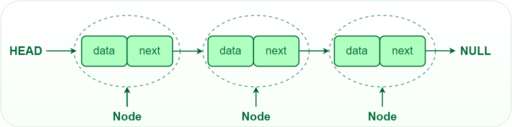

# Introduction to Linked List

A Linked List is a data structure consisting of a sequence of nodes. Each node contains data and a reference (link) to the next node in the sequence. Or A linked list is a list in which the list items are linked to other list items in a specific way. Different forms of linked lists have different ways of linking objects.

It is basically chains of nodes, each node contains information such as data and a pointer to the next node in the chain. In the linked list there is a head pointer, which points to the first element of the linked list, and if the list is empty then it simply points to null or nothing

### Why linked list data structure needed?

Here are a few advantages of a linked list that is listed below, it will help you understand why it is necessary to know.

* Dynamic Data structure: The size of memory can be allocated or de-allocated at run time based on the operation insertion or deletion.

* Ease of Insertion/Deletion: The insertion and deletion of elements are simpler than arrays since no elements need to be shifted after insertion and 
deletion, Just the address needed to be updated.

* Efficient Memory Utilization: As we know Linked List is a dynamic data structure the size increases or decreases as per the requirement so this avoids 
the wastage of memory. 

* Implementation: Various advanced data structures can be implemented using a linked list like a stack, queue, graph, hash maps, etc.

# types of Linked List.

There are mainly three types of linked:

* Single-linked list

Traversal of items can be done in the forward direction only due to the linking of every node to its next node.

* Double linked list

* Circular linked list

Linked lists can be measured as a form of high-level standpoint as being a series of nodes where each node has at least one single pointer to the next connected node, and in the case of the last node, a null pointer is used for representing that there will be no further nodes in the linked list. In the data structure, you will be implementing the linked lists which always maintain head and tail pointers for inserting values at either the head or tail of the list is a constant time operation. Randomly inserting of values is excluded using this concept and will follow a linear operation. As such, linked lists in data structure have some characteristics which are mentioned below:

* Insertion is O(1)

* Deletion is O(n)

* Searching is O(n)

Linked lists have a few key points that usually make them very efficient for implementing. These are:

* The list is dynamic and hence can be resized based on the requirement
* Secondly, the insertion is O(1).