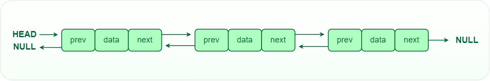
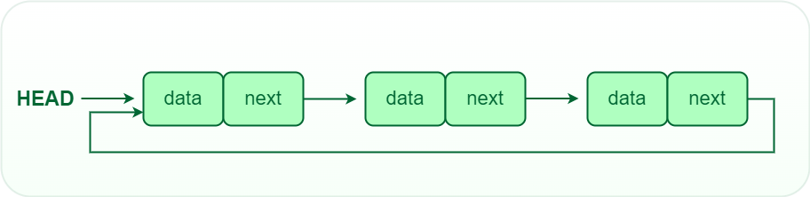

# Introduction to Linked List

A Linked List is a data structure consisting of a sequence of nodes. Each node contains data and a reference (link) to the next node in the sequence. Or A linked list is a list in which the list items are linked to other list items in a specific way. Different forms of linked lists have different ways of linking objects.

It is basically chains of nodes, each node contains information such as data and a pointer to the next node in the chain. In the linked list there is a head pointer, which points to the first element of the linked list, and if the list is empty then it simply points to null or nothing

### Why linked list data structure needed?

Here are a few advantages of a linked list that is listed below, it will help you understand why it is necessary to know.

* Dynamic Data structure: The size of memory can be allocated or de-allocated at run time based on the operation insertion or deletion.

* Ease of Insertion/Deletion: The insertion and deletion of elements are simpler than arrays since no elements need to be shifted after insertion and 
deletion, Just the address needed to be updated.

* Efficient Memory Utilization: As we know Linked List is a dynamic data structure the size increases or decreases as per the requirement so this avoids 
the wastage of memory. 

* Implementation: Various advanced data structures can be implemented using a linked list like a stack, queue, graph, hash maps, etc.

# Types of Linked List.

There are mainly three types of linked:

* Single-linked list

Traversal of items can be done in the forward direction only due to the linking of every node to its next node.

#Node class
class Node:
  
    # Function to initialize the node object
    def __init__(self, data):
        self.data = data  # Assign data
        self.next = None  # Initialize next as null
  
#Linked List class
  
  
class LinkedList:
  
    # Function to initialize the Linked List object
    def __init__(self):
        self.head = None

* Double linked list

Traversal of items can be done in both forward and backward directions as every node contains an additional prev pointer that points to the previous node

class Node:
    def __init__(self, next=None, prev=None, data=None):
        self.next = next  # reference to next node in DLL
        self.prev = prev  # reference to previous node in DLL
        self.data = data

* Circular linked list

A circular linked list is a type of linked list in which the first and the last nodes are also connected to each other to form a circle, there is no NULL at the end. 

def printList(self):
 
    temp = self.head
 
    # If linked list is not empty
    if self.head is not None:
        while(True):
 
            # Print nodes till we reach first node again
            print(temp.data, end=" ")
            temp = temp.next
            if (temp == self.head):
                break

# Operations on Linked List

* Insertion is O(1) Adding a new node to a linked list involves adjusting the pointers of the existing nodes to maintain the proper sequence. Insertion can be performed at the beginning, end, or any position within the list

# How to insert a Linked List

Given a Linked List, the task is to insert a new node in this given Linked List at the following positions: 

* At the front of the linked list  
* After a given node. 
* At the end of the linked list.

#### To insert a node at the start/beginning/front of a Linked List, we need to:

Make the first node of Linked List linked to the new node
Remove the head from the original first node of Linked List
Make the new node as the Head of the Linked List.

#This function is in LinkedList class
#Function to insert a new node at the beginning
def push(self, new_data):

	# 1 & 2: Allocate the Node &
	# Put in the data
	new_node = Node(new_data)

	# 3. Make next of new Node as head
	new_node.next = self.head

	# 4. Move the head to point to new Node
	self.head = new_node

# Complexity Analysis:

* Time Complexity: O(1), We have a pointer to the head and we can directly attach a node and change the pointer. So the Time complexity of inserting a node at the head position is O(1) as it does a constant amount of work.
* Auxiliary Space: O(1)

#### To insert a node after a given node in a Linked List, we need to:

Check if the given node exists or not. 
If it do not exists, 

terminate the process.

If the given node exists,

Make the element to be inserted as a new node

Change the next pointer of given node to the new node

Now shift the original next pointer of given node to the next pointer of new node

#This function is in LinkedList class.
#Inserts a new node after the given prev_node. This method is
#defined inside LinkedList class shown above */

def insertAfter(self, prev_node, new_data):

	# 1. check if the given prev_node exists
	if prev_node is None:
		print("The given previous node must inLinkedList.")
		return

	# 2. Create new node &
	# 3. Put in the data
	new_node = Node(new_data)

	# 4. Make next of new Node as next of prev_node
	new_node.next = prev_node.next

	# 5. make next of prev_node as new_node
	prev_node.next = new_node

Complexity Analysis:

* Time complexity: O(1), since prev_node is already given as argument in a method, no need to iterate over list to find prev_node
* Auxiliary Space: O(1) since using constant space to modify pointers.

#### To insert a node at the end of a Linked List, we need to:

Go to the last node of the Linked List
Change the next pointer of last node from NULL to the new node
Make the next pointer of new node as NULL to show the end of Linked List

#This function is defined in Linked List class

#Appends a new node at the end. This method is

#defined inside LinkedList class shown above

def append(self, new_data):

		# 1. Create a new node
		# 2. Put in the data
		# 3. Set next as None
		new_node = Node(new_data)

		# 4. If the Linked List is empty, then make the
		# new node as head
		if self.head is None:
			self.head = new_node
			return

		# 5. Else traverse till the last node
		last = self.head
		while (last.next):
			last = last.next

		# 6. Change the next of last node
		last.next = new_node

 Complexity Analysis:

* Time complexity: O(N), where N is the number of nodes in the linked list. Since there is a loop from head to end, the function does O(n) work. 
* This method can also be optimized to work in O(1) by keeping an extra pointer to the tail of the linked list/
* Auxiliary Space: O(1)

* Deletion is O(n) Removing a node from a linked list requires adjusting the pointers of the neighboring nodes to bridge the gap left by the deleted node. Deletion can be performed at the beginning, end, or any position within the list.

* Searching is O(n)  Searching for a specific value in a linked list involves traversing the list from the head node until the value is found or the end of the list is reached.

# Advantages of Linked List

* Dynamic Size: Linked lists can grow or shrink dynamically, as memory allocation is done at runtime.
Insertion and Deletion: Adding or removing elements from a linked list is efficient, especially for large lists.
* Flexibility: Linked lists can be easily reorganized and modified without requiring a contiguous block of memory.

# Disadvantages of Linked List

* Random Access: Unlike arrays, linked lists do not allow direct access to elements by index. Traversal is required to reach a specific node.
* Extra Memory: Linked lists require additional memory for storing the pointers, compared to arrays.

# Given the above explanation, create a node that will insert a new node at the end of Linked List.

class Node:
    def __init__(self, data):
        self.data = data
        self.next = None

#Given a reference (pointer to pointer)
#to the head of a list and an int, inserts
#a new node on the front of the list.

def push(head_ref, new_data):
    # Create a new node
   pass

    # Make the new node point to the current head
   pass

    # Update the head to point to the new node
    pass

    #Given a reference (pointer to pointer)
    pass
    #to the head of a list and an int,
    
    #appends a new node at the end

def append(head_ref, new_data):
    # Create a new node
    pass

    # Store the head reference in a temporary variable
   pass

    # Set the next pointer of the new node as None since it
    # will be the last node
    pass

    # If the Linked List is empty, make the new node as the
    # head and return
   pass

    # Else traverse till the last node
    
        pass

    # Change the next pointer of the last node to point to
    # the new node
   pass

# This function prints the contents of
# the linked list starting from the head

def printList(node):
    while node is not None:
        print(node.data, end=" ")
        node = node.next

Use the below code to test your code.

head = None

#Insert nodes at the beginning of the linked list

head = push(head, 6)

head = push(head, 5)

head = push(head, 4)

head = push(head, 3)

head = push(head, 2)

print("Created Linked list is:")

printList(head)

#Insert 1 at the end

head = append(head, 1)

print("\nAfter inserting 1 at the end:")

printList(head)

Look at the below link for the assignments solution.

[Linkedlist Solution](linked-list-solution.py)

# Conclusion:
Linked lists are versatile data structures that provide dynamic memory allocation and efficient insertion and deletion operations. Understanding the basics of linked lists is essential for any programmer or computer science enthusiast. With this knowledge, you can implement linked lists to solve various problems and expand your understanding of data structures and algorithms."
